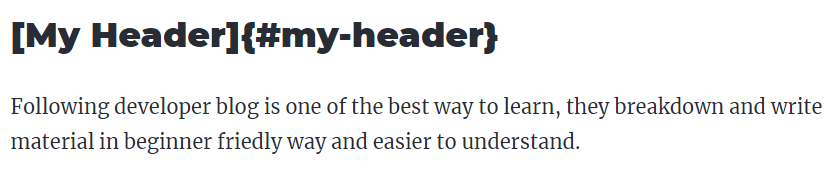
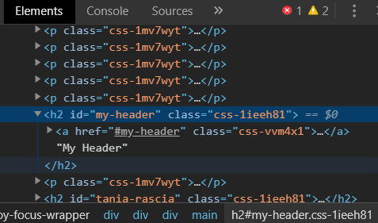

I would like to add a table of contents in MDX's blog. So, the visitors could easily navigate to the section they want to read first. It's should be an easy task but I as a beginner, I still struggling with it. Let's see what problem I face and how I settle it.

## What I do first?

After googling and read some article about markdown link

I found that to navigate to a section. Firstly, I need to add an id to a header then use the link navigate to the section with id

Refer to <a href='https://www.markdownguide.org/cheat-sheet/' target='_blank'  rel="noreferrer noopener">markdown guide cheatsheet</a>, I should add an id to the header like this:-

```markdown
## My Great Heading {#custom-id}
```

So, I write `## [My Header] {#my-header}` in MDX file and the result is:-



Why it output exactly what I write?

Maybe this Markdown syntax cannot be used in MDX?

I try google **MDX navigation to a section**, no relevant result

What Should I do?

I try to change the curly braces to bracket `## [My Header] (#my-header)`

My theme setting make the header white text and light blue on hover

Oh my god!

How should I do?

I take a break, and wandering and wondering around my living area

## Inspect the element

Maybe I should inspect the header, I don't know how this idea come to my mind.

I remove the markdown syntax and leave the header as it is. Then, inspect with Chrome and the result:-



What?! the id automatically added to header? Then why I struggle?

Maybe I should develop the habit to always inspect the element first before googling around and read article by article.

## Adding table of contents

Add a nagivation link with the id you want to navigate to:-

```markdown
[My Header](#my-header)
```

Normally, web developer add this at the top of blog post

So that, visitors can click it and navigate to **My Header** section. Then, press home on the keyboard to navigate back to top to choose other section they want to navigate to

Finally, I did it. This is 4 hours later...
