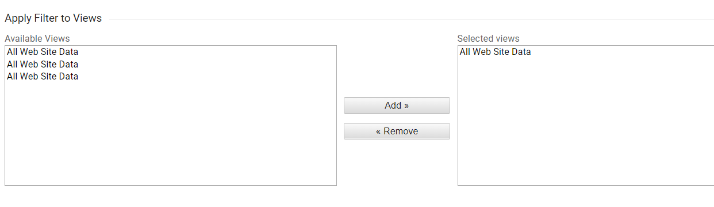

As a web developer, you often need to visit the website you build to check whether it work as you expected. However, after you implement Google Analytics to the website; even though you just visit for 10 second, it will calculate a bounce rate in your Google Analytics report. We call this **data pollution**

You would like to exclude all the IP addresses you want to exclude?

## How to check your IP address?

It's very simple, just type **What is ip my address** in any google search box. Google tell you your public IP address. If you cannot see it in your first search result. Scroll to check, eventually, you will find it.

You should always find out all the IP you don't want to track, eg:-

1. Your home WIFI
2. Your work WIFI
3. Your mobile network
4. Your freelancer home WIFI, work WIFI and mobile network
5. Your staff home WIFI, work WIFI, and mobile network
6. Your client home WIFI, work WIFI and mobile network
7. Any IP address you want to exclude

## How to exclude IP Address?

1. Login to your **Google Analytics** and select the correspondence property
2. Select **Admin** menu
3. Under account section, select **All Filters**
4. Click **Add Filter**
5. Give it a **Filter Name**
6. Filter Type choose **Predefined**
7. Select **Exclude** from "Select filter type" dropdown menu
8. Select **traffic from the IP address** from "Select source or destination" dropdown menu
9. Select **that are equal to** from "Select expression" dropdown menu
10. Fill in the IP address you want exclude in the input box.
11. Select **All Web Site Data** and add it to "Selected views"

    

12. click **Save**

\*Note: Filter will only effect from the date you apply the filter. Your history data remain the same.
