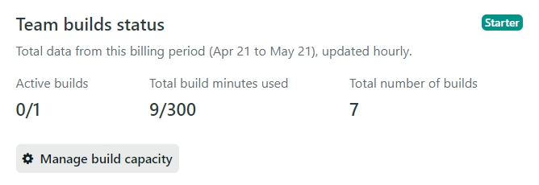
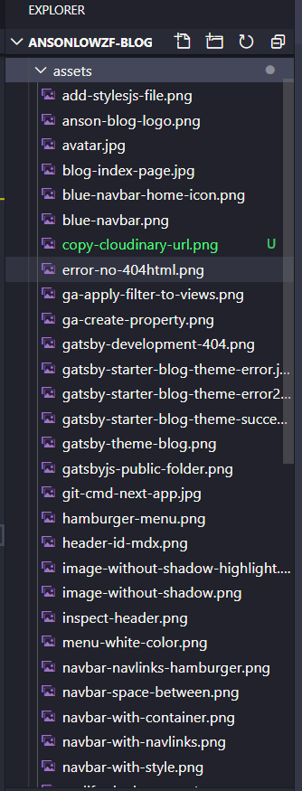
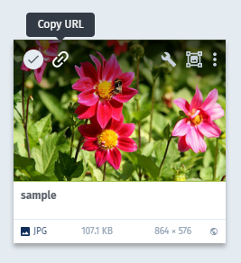
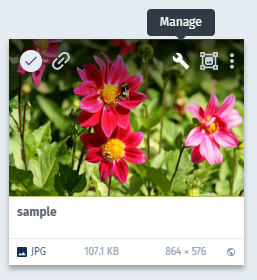

Early in the year of 2020, I watched a tutorial about Gatsby.js from Jason Lengstorf on <a href="https://frontendmasters.com/" target='_blank' rel='noreferrer noopener'>frontend master</a>. He mentioned images consume some of the Netlify's build time.

What is "Netlify build time"?



The free tier comes with 300 minutes of build time every month.
It's more than enough for a new developer's blog to be hosted on Netlify for free.
Thank you Netlify!

But, If you're freelancing and building websites for clients. You going to hit 300 minutes of build time fast.
If you want to save some build time, you could host your images somewhere and pull the image to your project with URL.

Even though I know I can save some build time but I still not motivate to explore Cloudinary. Until I started my blog on mid of April 2020,

Image explain thing more concise, I often print screen and use image explain thing in the blog.

When I keep adding more image to the folder. My image folder starts growing long.



It's easy to find a new image in VS Code with "Git version control", the new image I just add to the project will be shown in green text.

But it's not that easy to find a photo I added 1 month ago. Especially glance though an image list in the folder.

Sometimes, we need to use the same image, aren't we? How can I easily find the image? I start wondering how can I organize my image? I definitely will keep on adding more photo.

End of April 2020, YouTube recommends me to watch a Jason Lengstorf YouTube video regarding <a href="https://www.youtube.com/watch?v=lVi8KVeSTF4&t=2566s" target='_blank' rel='noreferrer noopener'>Cloudinary</a> feats Domitrius Clark which was published on April 17, 2020. In this video, Jason mention cloud storage for image, and image transformation with the image's URL.

I know, it's the right time for me to explore a new thing - Cloudinary

I highly recommend you to watch Jason's YouTube video about Cloudinary mentioned above.

## First try

I register an account at <a href="https://cloudinary.com/invites/lpov9zyyucivvxsnalc5/nwsdehaczllmpyud0hza" target='_blank' rel="noreferrer noopener">Cloudinary website</a>, answer some questions and walkthrough a 5 steps introduction.
Then I go to the media library and found a sample photo.

I copy the URL



And put in as a image source in my React.js project.

```js

```

A beautiful flower image has shown up


It's that simple,

It's work on CodeSandBox too.

## Tag an image

I click the manage button in the sample image



And found this section


Folder structure + tag + grid thumbnail in Cloudinary.

At this moment, I think I found the solution to organize my images. Even, there are thousands of images.

## Transformation

After taking 2 basic courses provided by <a href="https://training.cloudinary.com/" target='-blank' rel='noreferrer noopener'>Cloudinary academy</a> and earn the certificates.

Cloudinary, not just a cloud storage, it's more like a digital management hub.

You can do these on the fly - in URL:-

1. Resize width and height of your photo
1. Crop your photo,
1. Transform your face image to thumbnail
1. Change image format to jpg, png, webP and more
1. Apply filter to your photo
1. Remove image background
1. Most importantly - You can add watermark to your image
1. And so much more...

If you prefer to edit your image in the graphic user interface (GUI). You can edit in your Cloudinary platform.

## An image solution for me

I still haven't use Cloudinary to its full potential. More importantly, It's solved my image organizing problem. After this blog, I going to move all my images to Cloudinary.

<!-- ## Dynamic Resposive Image

Said your website has an high-resolution image use in desktop size, then user visit your website with mobile phone. Making the user load the same high-resolution image on mobile phone not only slow down loading your website, reduce your user browsing experience and a huge waste of bandwidth.

Normally, we prepare various size of the image and utilize picture tag srcset ditribute different size respond to different layout.

Cloudinary can make this process simple

You can set your image URL dynamically respond an optimal image for the image width.

It'a a feature allows you to upload one high-resolution image to Cloudinary, and has it automatically adapted to the resolution and size to different devices

Here are my Conclusion

1. You can store your photo and video and use in your website or the website you build for your clients
1. App photo solution, something like we can add photo in Facebook album. You can let visitor upload thier photo and video in your website or app.
1. You can edit your photo on the fly. Edit within the URL, Cloudinary Media library, Present your editing and apply it later, or in mass
1. You can add watermark
1. Command line photo editer
1. Serve as picture source set, Cloudinary will serve the best optimize image base on your website or app screen size
1. Serve your image thru CDN, what does this mean? Fast

It's like a mini-photo editor with command line
It's cloud media assets -->
