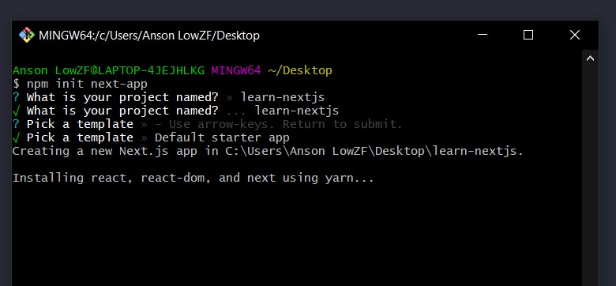

You might have notice, I'm writing more about Gatsbyjs. this blog you are reading is built with Gatsbyjs. It's mean I have zero knowledge about Nextjs except some little knowledge about Reactjs. Well, It's another fun time to learn something new.

## Why I want to learn Nextjs

I often have this a-ha moment when I start learning new React framework, It's like my brain leveling up. Suddenly, I understand this code and that code, and I understand more about Reactjs. I hope I can get some a-ha moment while learning Nextjs.

Nextjs v9.3 introduce Static Site Generation (SSG). Something like what Gatsbyjs is strong for. I want to know how Nextjs handle SSG compare to Gatsbyjs.

## Start a new Nextjs project

I run `npm init next-app` with **Git Bash** follow the Nextjs Docs,



Installing...

A few moment later,

I find out the command is acutally hang. It create a file with just package.json inside.

**Ctrl + c** to close the terminal and delete the file, then run the command with **Git Bash** again. Still the same problem,

Maybe, **create-next-app** is not compatible with **Git Bash**?

I switch to **Git CMD** and run the same command again,


It's installed successfully,

I follow the instuction:-

```shell
cd learn-Nextjs
yarn dev
```

The homepage show up


Check the existing code in the default starter and I learned:-

## 1. Public folder

There is a **/public** folder in the root directory. I read the <a href='https://nextjs.org/docs/basic-features/static-file-serving' target='_blank' rel='noreferrer noopener'>official docs</a>. It's used to serve static files and must be put in the root directory.

Save favicon, Robots.txt, images, Google site verification in public folder.

## 2. Head component

By looking at its implementation. It's used to control the browser title, favicon or more. Will check out later.

I amend the title as following:-

````js
// pages/index.js
<Head>
  <title>Learning Nextjs from Scratch</title>
  <link rel="icon" href="/favicon.ico" />
</Head>
```s

Then, I check the browser tab, wee~ it's work.

There is one more thing in the starter I will look at it later. A style tag with jsx and css inside.

```js
<style jsx>{`
  .container {
    min-height: 100vh;
    padding: 0 0.5rem;
    display: flex;
    flex-direction: column;
    justify-content: center;
    align-items: center;
  }
`}</style>
````

## Format on save with prettier

I remove all the code in the **index.js** file and add a h1 tag as following:-

<!-- prettier-ignore-start -->
```js
// pages/index.js

const Home = () => {
return (
<>
<h1>This is a home page</h1>
</>
  )
}

export default Home
```
<!-- prettier-ignore-end -->

Yo... the code does not format on save with prettier.

I create **.prettierrc** in the root directory and add some prettier code:-

```json
{
  "endOfLine": "lf",
  "semi": false,
  "singleQuote": false,
  "tabWidth": 2,
  "trailingComma": "es5"
}
```

My code look much better now,

```js
// pages/index.js

const Home = () => {
  return (
    <>
      <h1>This is a home page</h1>
    </>
  )
}

export default Home
```

At this point, I just realize I forget to import React. But, the code is working.

Seen like Nextjs import React by default. I check the website again. the docs also not importing React.

## Create a Layout component

Create **components** folder in the root directory then add **Layout.jsx** in the folder.

```jsx
// components/Layout.jsx

const Layout = ({ children }) => {
  return (
    <>
      <main>{children}</main>
      <style jsx>{`
        main {
          min-height: 100vh;
          padding: 0 0.5rem;
          display: flex;
          flex-direction: column;
          justify-content: center;
          align-items: center;
        }
      `}</style>
    </>
  )
}

export default Layout
```

Then wrap the index page with **Layout** component

```jsx
// pages/index.js

import Layout from "../components/Layout"

const Home = () => {
  return (
    <Layout>
      <h1>This is a home page</h1>
    </Layout>
  )
}

export default Home
```

## Layout with Head
