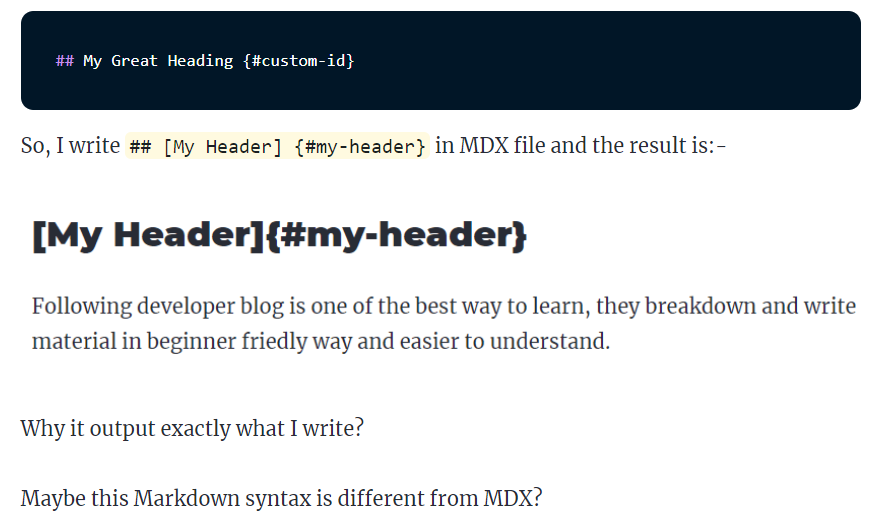
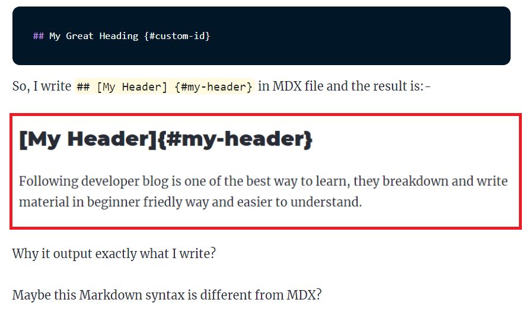

**gatsby-theme-blog** come with default styles from Theme-UI and also give you the flexibility to modify or add your own styles.

## How to style mdx element in gatsby-theme-blog site?

When I'm writing **MDX Navigation To Section** article, I find out the image I just add is like missing in light theme mode.



I couldn't see my image at first glance, could you see it?



This is actually an image but It's seen like a paragraph.

I'm thinking to add a box-shadow to showcase it's an image.

How do I style the MDX element?

It's time to dig gatsby's site,

One hour later...

Oh I see, if I want to style the MDX element, I need to shadow the **styles.js** component.

**Note**:
In case you want to know what is component shadowing, check out <a href="https://www.gatsbyjs.org/blog/2019-04-29-component-shadowing/" target='_blank' rel='noreferrer noopener'>this article</a>

I create **styles.js** and save it in **src/gatsby-theme-blog/gatsby-plugin-theme-ui** and add the following code:-

```js
export default {
  img: {
    boxShadow: `0 10px 20px rgba(0,0,0,0.19), 0 6px 6px rgba(0,0,0,0.23)`,
  },
}
```

What?! All MDX styles have gone! Why?

What I have just done? What happening?

Googling, researching, reading more article

A few monent later...

If I want to keep all MDX default styles and add my own style, I need to merge and extend from the default **style.js** component.

There are 2 options

1. Merge with either **deepmerge** or **lodash.merge** npm packages
2. Use JavaScript rest operator

As a new modern coding noob, I chosoe option 2:-

```js
import defaultThemeStyles from "gatsby-theme-blog/src/gatsby-plugin-theme-ui/styles"

export default {
  ...defaultThemeStyles,
  img: {
    boxShadow: `0 10px 20px rgba(0,0,0,0.19), 0 6px 6px rgba(0,0,0,0.23)`,
  },
}
```

Finally, it's work as expected, feel accomplish. Tear rolling at the edge of my eyes.
