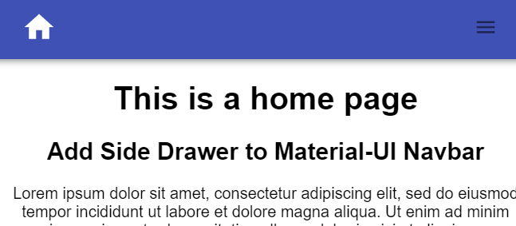
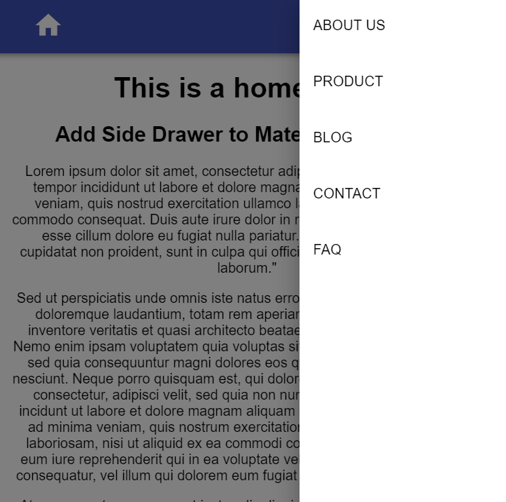
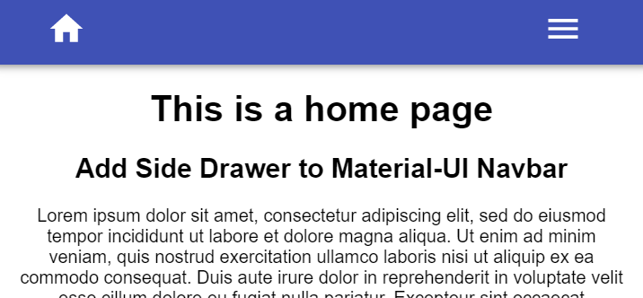
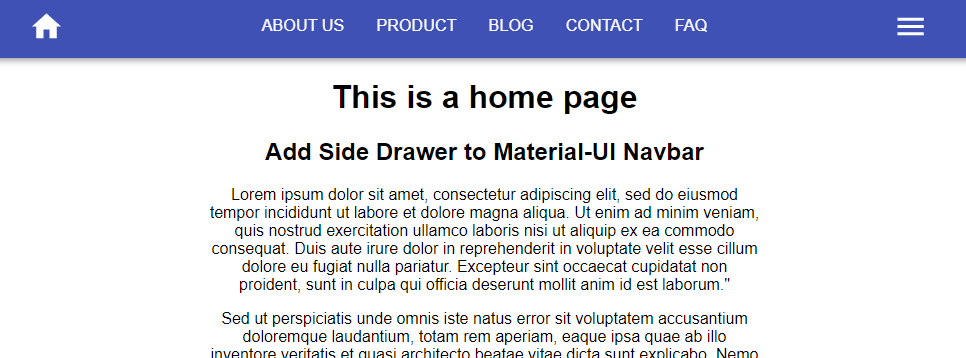

import { Link } from "gatsby"

This part 2 is a continuation section from part 1. If you direct land on this page, please check out part 1 before you continue...

| Series                                                                                      | Description                                                            |
| :------------------------------------------------------------------------------------------ | :--------------------------------------------------------------------- |
| <Link to='/how-to-create-navbar-header-with-material-ui'>Part 1</Link>                      | Create a header component and navbar for desktop                       |
| <Link to="/how-to-add-drawer-to-material-ui-navbar">Part 2</Link>                           | Add drawer component to navbar and make it mobile responsive           |
| <Link to='/add-hide-on-scroll-and-back-to-top-features-to-material-ui-navbar'>Part 3</Link> | Add **scroll to hide** & **back to top** feature to Material-UI navbar |

## Create side drawer

Create **src/components/SideDrawer.jsx**. Why I don't just name it Drawer.jsx is because Material-UI has a component with the same name.

Initial the component,

```js
import * as React from "react"

const SideDrawer = () => {
  return
}

export default SideDrawer
```

In order to see how our work is going on in visual

Go to **src/components/Header.jsx** and:-

```js
import SideDrawer from "./components/SideDrawer"
```

Comment out the List component and add **SideDrawer** component below it

<!-- prettier-ignore-start -->
```js
{/* <List
  component="nav"
  aria-labelledby="main navigation"
  className={classes.navDisplayFlex}
> ...</List>  */}
<SideDrawer />
```
<!-- prettier-ignore-end -->

Then go back to **SideDrawer** component and start working on it

We going to import the Material-UI component we going to use and a hamburger menu from Material-UI icons

## Hamburger Menu Icon

```js
import { IconButton } from "@material-ui/core"
import { Menu } from "@material-ui/icons"
```

```js
const SideDrawer = () => {
  return (
    <React.Fragment>
      <IconButton edge="start" aria-label="menu">
        <Menu />
      </IconButton>
    </React.Fragment>
  )
}
```

You can choose "end" or "start" for the edge. It just align the menu a bit right or left. I tested both, and find out at "start" look better in this project.

Save the file and you should see a hamburger menu show up



Next, we're going to add onClick event listener to toggle the drawer when visitor click the menu button

## Add toggle drawer

```js
import { useState } from "react"
```

Add state and toggle function

```js
const SideDrawer = () => {
  const [state, setState] = useState({ right: false }) // Add this

  const toggleDrawer = (anchor, open) => (event) => {
    if (
      event.type === "keydown" &&
      (event.key === "Tab" || event.key === "Shift")
    ) {
      return
    }

    setState({ [anchor]: open })
  }

    return (...restOfCode)
}
```

This "anchor" thing is Material-UI props to decide the drawer slide in from top, left, right or bottom.

Then add toggle function to **IconButton** component

```js
const SideDrawer = () => {
  return (
    <React.Fragment>
      <IconButton
        edge="start"
        aria-label="menu"
        onClick={toggleDrawer("right", true)} {/* Add this*/}
      >
        <Menu />
      </IconButton>
    </React.Fragment>
  )
}
```

## Side drawer list

Since we're going to use the same navLinks, we can grab the data from it parent.

Go to **Header** component and pass navLinks as props

```js
<SideDrawer navLinks={navLinks} />
```

then destructure the data in **SideDrawer** component

```js
const SideDrawer = ({ navLinks }) => {
    ...restOfCode
}
```

Use the data to create **SideDrawer** as below:-

```js
const toggleDrawer = (anchor, open) => event => {...};

const sideDrawerList = (anchor) => (
  <div
    role="presentation"
    onClick={toggleDrawer(anchor, false)}
    onKeyDown={toggleDrawer(anchor, false)}
  >
    {navLinks.map(({ title, path }) => (
      <List component="nav">
        <a href={path} key={title}>
          <ListItem button>
            <ListItemText primary={title} />
          </ListItem>
        </a>
      </List>
    ))}
  </div>
)
```

**Important:** Please do not use anchor tag for internal navigation in your React.js project. I use it for demo purpose only. My real project is using **Link** component from Gatsby.js, you can always use your favourite library such as **reach/router**, **react-router** or other similar libraries.

## Add style

```js
import { makeStyles } from "@material-ui/core/styles"
```

Create an useStyles variable below all the import statement

```js
const useStyles = makeStyles({
  list: {
    width: 250,
  },
  linkText: {
    textDecoration: `none`,
    textTransform: `uppercase`,
    color: `black`,
  },
})
```

Then call it inside the component and assign it classes variable

```js
const SideDrawer = () => {
  const classes = useStyles(); // This

  ...restOfCode
}
```

Then apply them to

```js
const sideDrawerList = (anchor) => (
  <div
    className={classes.list} /*Add this */
    role="presentation"
    onClick={toggleDrawer(anchor, false)}
    onKeyDown={toggleDrawer(anchor, false)}
  >
    <List component="nav">
      {navLinks.map(({ title, path }) => (
        <a href={path} key={title} className={classes.linkText} /*Add this*/>
          <ListItem button>
            <ListItemText primary={title} />
          </ListItem>
        </a>
      ))}
    </List>
  </div>
)
```

Next, we going to create the drawer by:-

```js
import {..., Drawer } from '@material-ui/core'
```

What we want is when the menu button is clicked, the drawer slide in from the right.
Add the following code below **IconButton**

```js
<IconButton...</IconButton>
<Drawer
  anchor="right"
  open={state.right}
  onOpen={toggleDrawer("right", true)}
  onClose={toggleDrawer("right", false)}
>
  {sideDrawerList("right")}
</Drawer>
```

Save and click the menu icon, you shall see



Well, the menu icon is working, we need to style it to match our home icon

```js
<Menu fontSize="large" style={{ color: `white` }} />
```



Uncomment the **List** component in **Header** Component

```js
<List
  component="nav"
  aria-labelledby="main navigation"
  className={classes.navDisplayFlex}
> ...</List>
<SideDrawer />
```



How could we just show the main navigation in tablet and desktop but only show hamburger menu in mobile?

Go to **Header** component and:-

```js
import { ..., Hidden } from '@material-ui/core'
```

Then wrap the **List** and **SideDrawer** component.

```js
<Hidden smDown> {/* This*/}
    <List>
      ...restOfCode
    </List>
</Hidden>
<Hidden mdUp> {/*This */}
    <SideDrawer navLinks={navLinks} />
  </Hidden>
```

This **Hidden** component will hide the **List** component when the screen is smaller than "sm".
And hide the **SideDrawer** component when the screen is bigger than "md"

Wala, check the navbar with different viewport now

You should see the hamburger hidden in tablet and desktop screen size, and show in mobile screen size.

In case you want to know what is the breakpoints of the screen size for "sm" or "md",
you could check out <a href="https://material-ui.com/customization/breakpoints/" target='_blank' rel='noreferrer noopener'>Material-UI docs</a>

Check out the code:-

<a href="https://codesandbox.io/s/how-to-add-side-drawer-to-material-ui-navbar-3ypye?fontsize=14&hidenavigation=1&theme=dark">
  
</a>

Next, we going to add hide on scroll and back to top features to navbar

<Link to="/add-hide-on-scroll-and-back-to-top-features-to-material-ui-navbar">
  Part 3
</Link>{" "}
