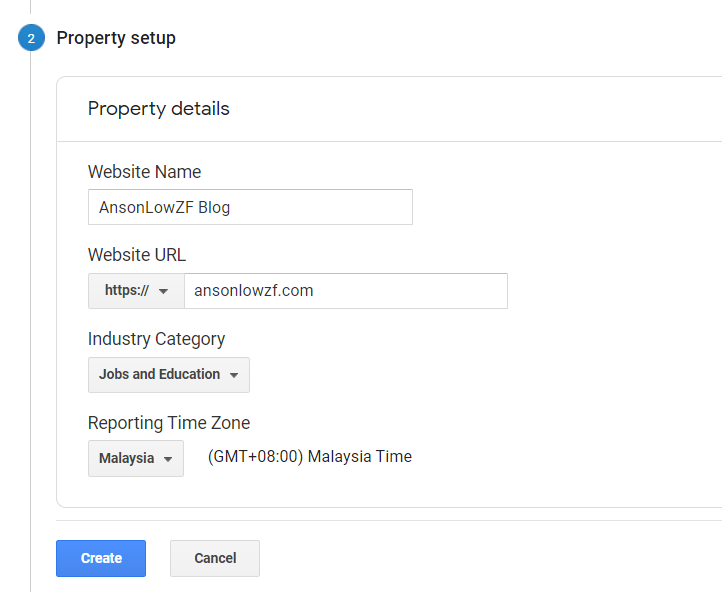

## Create a new property in your account

Login to your **Google Analytics account**.

Go to **Admin**

Click **Create Property**

There are 3 options:-

1. Web
2. Apps
3. Apps and web

In my case, I select Web and click **Continue**

Fill in the necessary information



Frankly speaking, I not sure the industry I select is correct for a web developer blog or not. Shall I should other instead? Please tell me if you know it.

After you fill in your information click **Create**

Aftewards, Google Analytics will generate a tracking ID **UA-12345678** for you

Install Gatsbyjs plugin for Google Analytics

```shell
npm install --save gatsby-plugin-google-analytics
```

While waiting for the installation, config the plugin in **gatsby-config.js** as below:-

```js
module.exports = {
  plugins: [
    {
      resolve: `gatsby-plugin-google-analytics`,
      options: {
        trackingId: "UA-12345678",
        // Google Analytics recommend to add the script to head tag, so I set head to true
        head: true,
      },
    },
  ],
}
```

If you would like to know more about the options setting, Check out the Gatbsyjs plugin details <a href='https://www.gatsbyjs.org/packages/gatsby-plugin-google-analytics/' target='_blank' rel='noreferrer noopener'>here</a>

To check whether your tracking ID is successfully added to your website, `Ctrl + c` to close your development environment then run:-

```shell
gatsby build && gatsby serve
```

Visit localhost:9000

1. `Ctrl + u` or right click and choose view page source
2. `Ctrl + f` and paste in your tracking ID in the search field

If you could find tracking ID, it's mean you're successfully added google analytics to your website.
