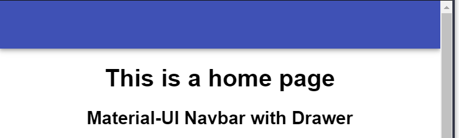
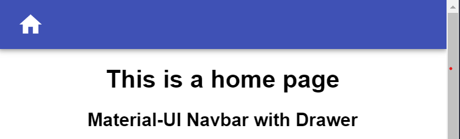
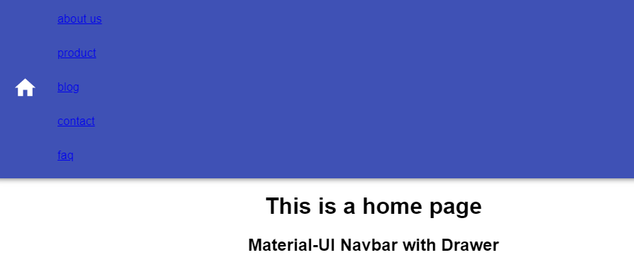
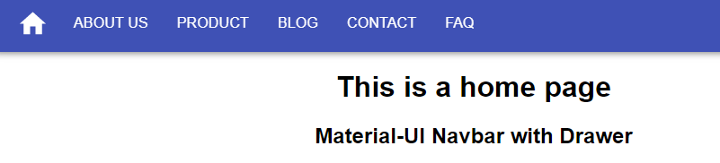
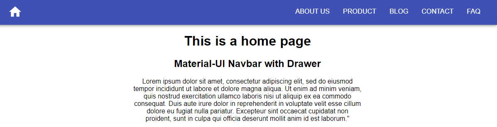
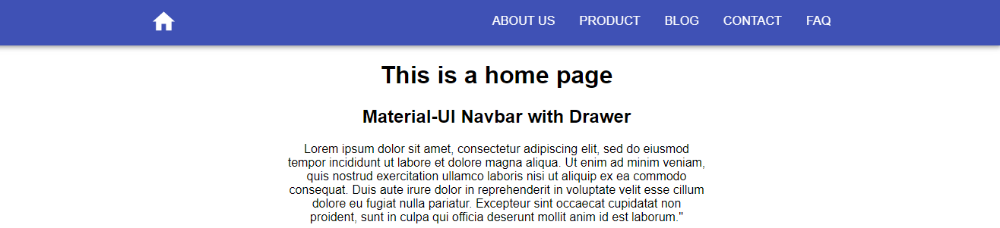

import { Link } from "gatsby"

Our goal is to create a production-ready Material-UI navbar with some modern features.

| No.                                                                                         | Description                                                            |
| :------------------------------------------------------------------------------------------ | :--------------------------------------------------------------------- |
| <Link to='/how-to-create-navbar-header-with-material-ui'>Part 1</Link>                      | Create a Header component and navbar for desktop                       |
| <Link to="/how-to-add-drawer-to-material-ui-navbar">Part 2</Link>                           | Add drawer component to navbar and make it mobile responsive           |
| <Link to='/add-hide-on-scroll-and-back-to-top-features-to-material-ui-navbar'>Part 3</Link> | Add **scroll to hide** & **back to top** feature to Material-UI navbar |

## 1. Create a Header component and navbar for desktop

**Note:** Please note that part 1 is not production-ready. Please do not use it in your project. We just created a Header component and it's not mobile friendly yet.

Install these 2 Material-UI dependencies into your React.js project

```shell
npm install @material-ui/core

npm install @material-ui/icons
```

Then create **src/components/Header.jsx**

You can just use JS extension, I choose to use JSX is because it enables Emmet feature in VS Code.

## Create navbar

I create navigation links variable in the **Header** component. You could also create a JSON or JS file separately and import it to the **Header** component. Since this is a small project, create the nav links in the component let us work easier.

```jsx
const navLinks = [
  { title: `about us`, path: `/about-us` },
  { title: `product`, path: `/product` },
  { title: `blog`, path: `/blog` },
  { title: `contact`, path: `/contact` },
  { title: `faq`, path: `/faq` },
]
```

Initial **Header** component to create a navbar:-

```js
import * as React from "react"
import { AppBar, Toolbar } from "@material-ui/core"

const navlinks = [...]

const Header = () => {
  return (
    <AppBar position="static">
      <Toolbar></Toolbar>
    </AppBar>
  )
}

export default Header
```

Save the file and go to **src/index.js**, import **Header** component and add it above **App** component.

```js
import Header from "./components/Header"

const rootElement = document.getElementById("root")
ReactDOM.render(
  <React.StrictMode>
    <Header /> {/*Add this*/}
    <App />
  </React.StrictMode>,
  rootElement
)
```

Save the **index.js** file, you should see a blue colour navbar appear



If you see gap surrounded the navbar.

Add the following code to your global CSS file

```css
* > body {
  margin: 0;
  box-sizing: border-box;
}
```

## Add logo

Since I don't have any logo for this project, I will just use a home icon act as a logo.
In fact, I often use this home icon in my real project to make it obvious to visitor,
this is a click to the home button.

```js
import { ..., IconButton } from "@material-ui/core"
import { Home } from "@material-ui/icons"
```

Then add the following code inside **Toolbar** component

```js
const Header = () => {
  return (
    <AppBar position="static">
      <Toolbar>
        {/* Add code */}
        <IconButton edge="start" color="inherit" aria-label="home">
          <Home fontSize="large" />
        </IconButton>
        {/* Add code end */}
      </Toolbar>
    </AppBar>
  )
}
```

Save the file, you should see the home icon show up



## Add Navlinks

```js
import { ..., List, ListItem, ListItemText } from "@material-ui/core"

```

Add the following code inside **Toolbar** component

```js
<Toolbar>
  <IconButton edge="start" color="inherit" aria-label="home">
    <Home fontSize="large" />
  </IconButton>
  {/* Add code */}
  <List component="nav" aria-labelledby="main navigation">
    {navLinks.map(({ title, path }) => (
      <a href={path} key={title}>
        <ListItem button>
          <ListItemText primary={title} />
        </ListItem>
      </a>
    ))}
  </List>
  {/* Add code end */}
</Toolbar>
```

**Important:** Please do not use anchor tag for internal navigation in your React.js project. I use it for demo purpose only. My real project is using **Link** component from Gatsby.js, you can always use your favourite library such as **reach/router**, **react-router** or other similar libraries.

Save the file again, you should see



What a mess, everything squeezes together,

Let's apply some styling to make it look nicer, I use Material-UI's makeStyles hook API to write CSS-in-JS

```js
import { makeStyles } from "@material-ui/core/styles"
```

Create an useStyles variable below all the import statement

```js

const useStyles = makeStyles({
  navDisplayFlex: {
    display: `flex`,
    justifyContent: `space-between`
  },
  linkText: {
    textDecoration: `none`,
    textTransform: `uppercase`,
    color: `white`
  }
});

navlinks = [...]

```

Then call it inside **Header** component and assign it classes variable

```js
const Header = () => {
  const classes = useStyles(); // Add this

  ...restOfCode
}
```

and apply like so:-

```js
<List
  component="nav"
  aria-labelledby="main navigation"
  className={classes.navDisplayFlex} // this
>
  {navLinks.map(({ title, path }) => (
    <a href={path} key={title} className={classes.linkText}  {/* this */}>
      <ListItem button>
        <ListItemText primary={title} />
      </ListItem>
    </a>
  ))}
</List>
```

Save the file and you will see



How could we align the navigation links to the right? Before this, let's add a **Container** component to wrap home icon and navigation links. You will know why we need to add this component later.

```js
import { ..., Container } from "@material-ui/core"
```

and wrap **IconButton** & **List** component like this

```js
<Toolbar>
  <Container>
    <IconButton>...</IconButton>
    <List>...</List>
  </Container>
</Toolbar>
```

Afterwards, add this CSS code's object into makeStyles function

```js
const useStyles = makeStyles({
  navbarDisplayFlex: {
    display: `flex`,
    justifyContent: `space-between`
  },
  ..restOfCode
});
```

Apply it to **Container** component

```js
<Toolbar>
    <Container className={classes.navbarDisplayFlex}>
    ...restOfCode
```

Save the file and you will see



They're too close to the left and right edges and space quite far away. How could we make them closer toward the center?

Just apply maxWidth to **Container** component will do, this is the purpose I add **Container** component earlier.

```js
<Toolbar>
  <Container maxWidth="md" className={classes.navbarDisplayFlex}>
    <IconButton>...</IconButton>
    <List>...</List>
  </Container>
</Toolbar>
```



You could choose your maxWidth from "xs", "sm", "md", "lg", and "xl" to find out which distance you want.

In case you want to know what is the breakpoints of the screen size for "sm" or "md",
you could check out <a href="https://material-ui.com/customization/breakpoints/" target='_blank' rel='noreferrer noopener'>Material-UI docs</a>

check out the code:-

<a
  href="https://codesandbox.io/s/how-to-build-material-ui-navbar-header-cu3sf?fontsize=14&hidenavigation=1&theme=dark"
  target="_blank"
  rel="noreferrer noopener"
>
  
</a>

Next

We'll add a Drawer component to navbar and make it mobile responsive

<Link to="/how-to-add-drawer-to-material-ui-navbar">Part 2</Link>{" "}
