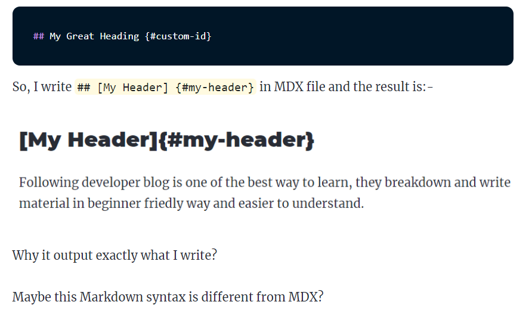
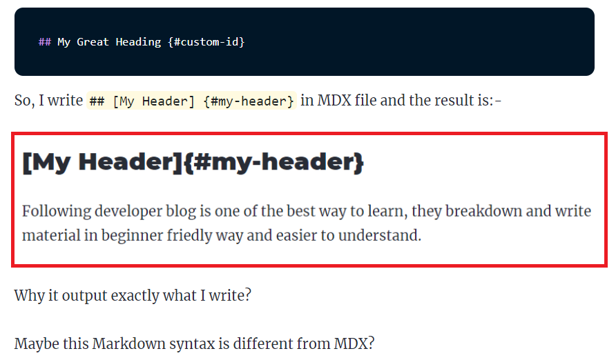
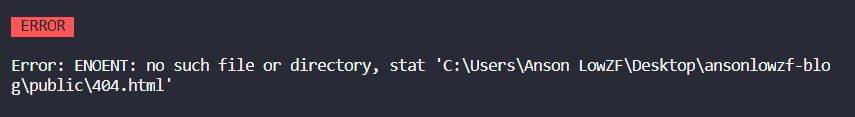
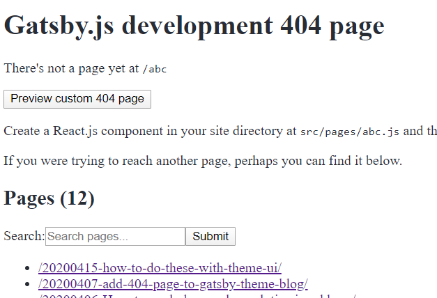

import { Link } from "gatsby"

**gatsby-theme-blog** include default styling from Theme-UI. It gives you basic styling but also give you the flexibility to modify and add your own styles. I document what is missing in **gatsby-theme-blog** and how I solve them in this blog.

## How to style mdx element in gatsby-theme-blog site?

While I'm writing **MDX Navigation To Section** article, I find out my image is like missing.



I couldn't see my image at first glance, could you see it?



This is actually a picture. Without styling, I'm confused whether it's text or picture especially both have the same background.

Add a box-shadow to the picture is a great idea (at least I think so),

How to style the MDX element?

After reading some article in gatsby's site,

To style the MDX element, I need to shadow the styles.js component

In case you want to know what is shadowing, check out <a href="https://www.gatsbyjs.org/blog/2019-04-29-component-shadowing/" target='_blank' rel='noreferrer noopener'>this article</a>

I create **styles.js** and save it into **src/gatsby-theme-blog/gatsby-plugin-theme-ui** and add the following code:-

```js
export default {
  img: {
    boxShadow: `0 10px 20px rgba(0,0,0,0.19), 0 6px 6px rgba(0,0,0,0.23)`,
  },
}
```

What the... all MDX styles have gone! Why?

Oh my god, what I have just done?

Googling, researching, reading more article

4 hours later...

To keep all the MDX default styles and extend my own style, I need to merge them.

There are 2 options

1. Merge with either **deepmerge** or **lodash.merge** npm packages
2. Use JavaScript rest operator

As a new modern coding noob, I use the rest operator like so:-

```js
import defaultThemeStyles from "gatsby-theme-blog/src/gatsby-plugin-theme-ui/styles"

export default {
  ...defaultThemeStyles,
  img: {
    boxShadow: `0 10px 20px rgba(0,0,0,0.19), 0 6px 6px rgba(0,0,0,0.23)`,
  },
}
```

Finally, it's work as expected, feeling accomplishment. Tear rolling at the edge of my eyes

## How to add 404 page to gatsby-theme-blog site?

I'm writing **How to add Google Analytics to gatbsyjs Site** article, when I build the site and search for the Tracking ID. The terminal is throwing a red warning to me



Oh no, gatsby-starter-blog-theme does not come with 404 page. I don't aware of this until I wrote my 8th article.

I search related topic in gatsbyjs site and land myself at <a href='https://www.gatsbyjs.org/docs/add-404-page/' target='_blank' rel='noreferrer noopener'>page</a>

After reading it and I found one paragraph said:-

> Because Gatsby creates this page for you by default, there is no need to configure it in your **gatsby-node.js** file.

404 page is not created by default for gatsby-starter-blog-theme starter. Gatsby's team should do something about it.

Anyway, I going to add it manually

Next paragraph said:-

> When developing using `gatsby develop`, Gatsby uses a default 404 page that overrides your custom 404 page. However, you can still preview your 404 page by clicking “Preview custom 404 page” to verify that it’s working as expected. This is useful when you’re developing so that you can see all the available pages.

After run `gatsby develop`, I visit a page not existed /localhost:8000/abc



I click **Preview custom 404 page**, a message appear and shown

> A custom 404 page wasn't detected - if you would like to add one, create a component in your site directory at src/pages/404.js.

I create a directory **pages** In **src** folder and add a file named **404.js**

Then I go to **gatsby-starter-default** starer <a href="https://github.com/gatsbyjs/gatsby-starter-default/blob/master/src/pages/404.js" target='_blank' rel='noreferrer noopener'>github source code</a> to copy the 404.js code and modify a bit

```js
import { Link } from "gatsby"
import React from "react"
import SEO from "gatsby-theme-blog/src/components/seo"

const NotFoundPage = () => (
  <>
    <SEO title="404: Not found" />
    <div
      style={{
        width: `100vw`,
        height: `100vh`,
        display: `flex`,
        justifyContent: `center`,
        alignItems: `center`,
      }}
    >
      <div>
        <h1>NOT FOUND</h1>
        <p>
          {`You just hit a route that doesn't exist... Please visit `}{" "}
          <Link to="/" className="link-style">
            Homepage
          </Link>
        </p>
      </div>
    </div>
  </>
)

export default NotFoundPage
```

Wala... 404.html created as easy as that.

To check out my amazing 404 page, <a href="ansonlowzf.com/abc">click here</a>
