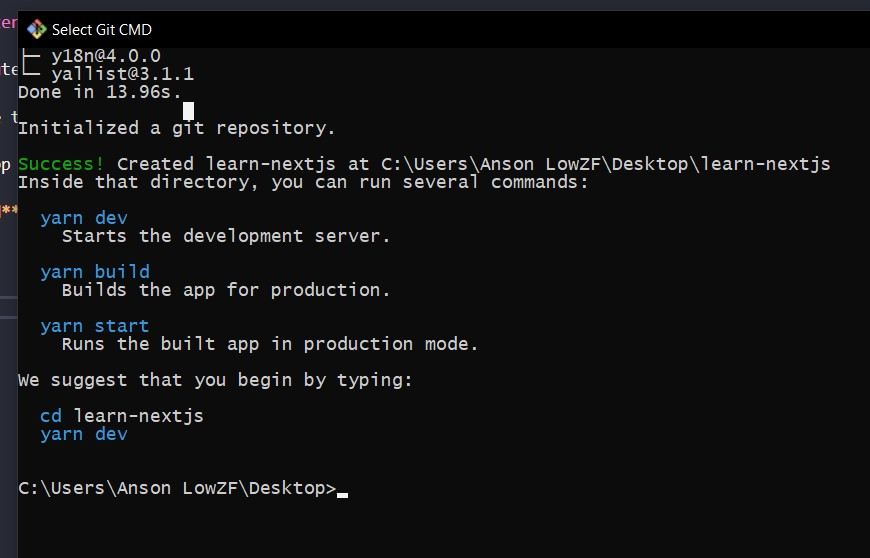
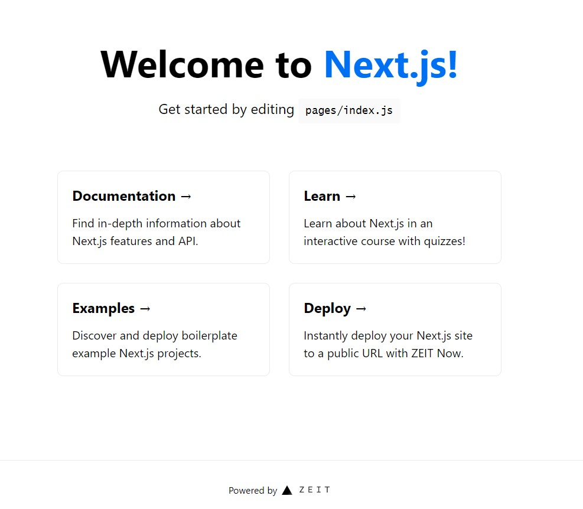

To create a Nextjs project, run `npm init next-app`

I used **Git Bash** to run the command, then I get the result as following:-


I waited for 3-4 minutes, then only find out the command is acutally hang in the terminal,

**Ctrl + c** to close the terminal, and run the command again. Same problem,

I think **create-next-app** is not compatible with **Git Bash**,

I switch to **Git CMD** and run the command again,

It's work, wink~



Follow the instuction:-

```shell
cd learn-Nextjs
yarn dev
```

The homepage show up



I learn one thing with this default starter

1. Put favicon in public folder, this public folder must be on the root
2. **Head from 'next/head'** used to control the tab title and favicon

Well, my first impression to Nextjs is amazing.
