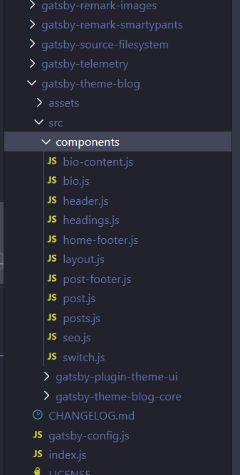

Thank you Gatsby's team and Hashim Warren to start the 100DaysOfGatsby challenge. It's a step by step guide to learn gatsby.js from scratch. Every week, Hashim will send you the challenge together with link resources to help you complete the challenge.

In case you are interested in the weekly challenge, visit <a href="https://www.gatsbyjs.org/blog/tags/100-days-of-gatsby" target='_blank' rel='noreferrer noopener'>100DaysOfGatsby</a>

This bonus tip is a final kick for me to make the final decision to start a blog.

> Use your new blog to track your #100DaysOfGatsby progress! Research shows that writing about what you learn, or even what you're struggling with helps you to retain that information, or even discover a solution. So, during your #100DaysOfGatsby journey, we encourage you to use this blog to write about your ups and downs, victories and challenges.
> \- By Hashim Warren

## Challenge 1: Create a Gatsby blog from scratch

First, I learned the basic of gatsby.js from <a href="https://www.gatsbyjs.org/tutorial/" target='_blank' rel='noreferrer noopener'>Gatsby's tutorials</a>. You will learn how to generate a gatsby site with a gatsby starter in lesson 1. It's like a boilder-plate for you to start a gatsby site easily.

After complete the lessons, I check out the <a href="https://www.gatsbyjs.org/starters/?v=2" target="_blank" rel="noreferrer noopener">Gatsby Starter Library</a> to find a starter for my blog. After applying the filter, there are around 133 blog starters. Time passed 1 hour++, I still can’t decide which one to use.

When I'm stuck, It means it's a time to take a rest and grab a cup of coffee...

Come back to the desk, continue browsing gatsby.js' website. Tic toc, tic toc, don't know how long the time had passed, I reached <a href="https://www.gatsbyjs.org/tutorial/using-a-theme/" target="_blank" rel="noreferrer noopener">this page</a> and see a starter which cannot be found in the starter library, weird huh?

Run the command,

```shell
gatsby new my-blog https://github.com/gatsbyjs/gatsby-starter-blog-theme
```

Then

```shell
cd my-blog
gatsby develop
```

What? error...! Some Invalid Hook message shows up.

Double-check the page,

Check 1, check 2, check 3, every word and spelling are correct. What is the problem? Scratching head...

Dig here dig there, wondering... continue scratching head...

20 mins later, oh... maybe I need to run,

```shell
npm install
```

Since I run npm install, without thinking further I also run:-

```shell
npm update
```

To make sure every package are up to date,

Afterwards, I run

```shell
gatsby develop
```

Open localhost:8000 in my browser. Oh, it works as expected,

Tear rolling at the edge of my eyes,

Forgive me so noob!

This starter is pre-config with **gatsby-theme-blog** and it's similar to Dan Abramov's blog named [overreacted.io](https://overreacted.io/).

I like simple and concise design and start to imagine I'm writing an article like Dan Abramov

Bang! bang! bang my head on to the wall, It's time to wake up, enough daydreaming.

Continue to follow the guide

## Replace your avatar

The guide said

> The blog theme starter ships with a solid gray image for the avatar. Add your own avatar by choosing the image you want, and overwriting the file located at /content/assets/avatar.png.

Let me find a handsome photo and put in the content/assets photo

Found one and rename it to ansonlowzf-handsome-photo.jpg

Drop it to content/assets folder

Hmmm... where the heck, I can modify and the path to ansonlowzf-handsome-photo.jpg?

Check gatsby-config.js file, package.json? I open every file and check line by line,

Oh, mama, how can I config it?

10 mins later,

I give up,

**if you know how to do it, please share with me.** My email is zhanfaye@gmail.com

I rename it to avatar.jpg

Finally, my handsome face show up,

If your handsome face not showing up, `Ctrl + c` to stop your development server and `gatsby-develop` to restart it. If the problem persist, stop development server, close your editor, reopen your editor and start development server again.

## Replace the content of the bio

This one is pretty straight forward

I check **node_modules/gatsby-theme-blog**



As you can see, these 11 components could be overwrited if you create a file exactly match the name and save it into **src/gatsby-theme-blog/components**

This is called component shadowing,

Thanks gatsby.js, I learn a new thing today.

To modify **bio content**, avigate to **src/gatsby-theme-blog/components**, open **bio-content.js** which already exist in the folder

I write:-

```js
import React, { Fragment } from "react"
import { Link } from "gatsby"

export default () => (
  <Fragment>
    Learning to be a digital marketer &amp; web developer.
    <br />
    <Link to="/about-me">More about me</Link>
  </Fragment>
)
```

`Ctrl + s`, the bio content beside my handsome face change almost immedietaly,

gatsby-theme-blog is so cool, isn't it?

## Create a new blog post

`Ctrl + c` to stop your development server, then

Add a file with mdx extention **my-new-blog.mdx** and save it into **content/posts**

Add the following content to **my-new-blog.mdx**

```mdx
---
title: My New Blog Post
date: 2020-01-31
---

My blog post content...
```

`gatsby develop` to start development server again

As simple as that, your newly created blog post appear in blog list. Click the title to see your amazing blog content.

## Change the color theme

There is a file **colors.js** exist in **gatsby-plugin-theme-ui**

Just uncommented all code in the file, your theme immedietaly change to blue color theme.

If you don't like the color theme, just modify each part of them with your color

```js
import merge from "deepmerge"
import defaultThemeColors from "gatsby-theme-blog/src/gatsby-plugin-theme-ui/colors"

const darkBlue = `#007acc`
const lightBlue = `#66E0FF`
const blueGray = `#282c35`

export default merge(defaultThemeColors, {
  text: blueGray,
  primary: darkBlue,
  heading: blueGray,
  modes: {
    dark: {
      background: blueGray,
      primary: lightBlue,
      highlight: lightBlue,
    },
  },
})
```

It's that simple to start a blog with gatsby.js, try it yourself.

Thank you for reading...
