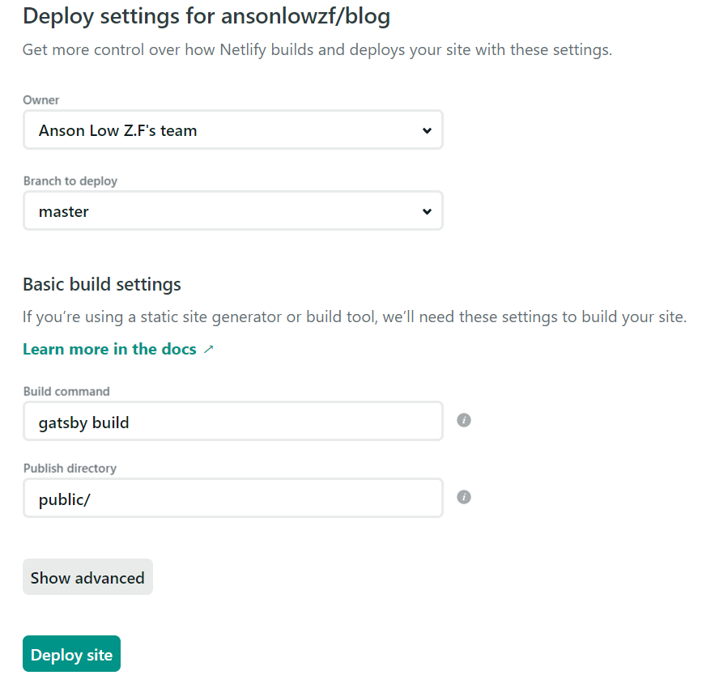

## Challenge 2: Build and Deploy Your Gatsby Site

After surveying Zeit, Surge, Heroku, Google Firebase, I chose to host my blog on netlify.

Register your account with <a href="https://www.netlify.com/" target="_blank" rel="noreferrer noopener">Netlify</a>

It's fairly simple to use,

**1. Drag & drop to Netlify:-**

Run

```terminal
gatsby build && gatsby serve
```

Gatsby will build and host the blog in your local machine at port **localhost:9000**

If it's successfully build and you could see your blog showing

Mostly probably, Netlify will successfully build your blog in their serve

Ctrl + c to close your local server

Open your directory where you save your file, you will see a public folder had been created by gatsby


Then, drag and drop your public folder to the following section


Draw back for this method is you need to run gatsby build and drop the public to netlify everytime you have a new update

**2. Continue Deployment** My Preference


Choose your remote hosting


Authorize and login to your remote hosting account

Pick up the repository you want to link



Leave the default setting as above and deploy your site

This way of deployment, everytime you push your lastest change to remote master branch

Netlify will rebuild, update and deploy your new blog
