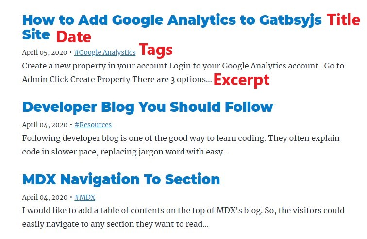

## What is front-mattter in markdown?

```mdx
---
title: This is a title
date: YYYY-MM-DD
tags: ["tag A", "tag B", tag C]
---
```

The properties and value written in the three dashes are front-matter. We could display them in blog index page like below:-



If you are using Content Management System such as Jekyll or Hugo, they have **predefined global variables** you must follow. You could their frontmatter page:-

<ol>
  <li>
    <a
      href="https://jekyllrb.com/docs/front-matter/"
      target="_blank"
      rel="noreferrer noopener"
    >
      Jekyll front-matter
    </a>
  </li>
  <li>
    <a
      href="https://gohugo.io/content-management/front-matter/"
      target="_blank"
      rel="noreferrer noopener"
    >
      Hugo front-matter
    </a>
  </li>
</ol>

If you are setting up a blog site yourself, you could define your own variables name. Then use it in blog index page

Example properties people often use:-

```mdx
---
title:
date:
excerpt:
author:
slug:
category:
coverImage:
---
```
